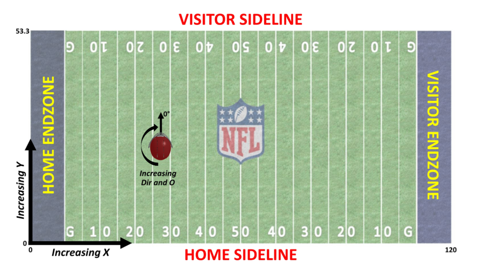

```{r setup, include=FALSE}
knitr::opts_chunk$set(echo = TRUE)
library(dplyr)
 (library(readr))
 (library(mosaic))
 (library(tidyverse))
 (library(glmnet))
 (library(class))
 (library(modelr))
 (library(lubridate))
 (library(caret))
 (library(vip)) 
 (library(gbm))
 (library(purrr))
library(randomForest)
library(lubridate)
library(hms)
library(ggpmisc)
library(gt)
library(gtExtras)
```


```{r, include=FALSE, echo = FALSE, messages = FALSE}
final_data_expanded <- read_csv("~/Big_Data_Bowl/expanded_final_data.csv")

play_level <- read_csv("~/Big_Data_Bowl/play_level_data.csv")

plays <- read_csv("~/Big_Data_Bowl/nfl-big-data-bowl-2025/plays.csv")

full_data_final <- read_csv("~/Big_Data_Bowl/full_data_final.csv")

example_player <- read_csv("~/Big_Data_Bowl/player_example.csv")

example_av <- read_csv("~/Big_Data_Bowl/player_example_av.csv")

```

<br>
<hr>


### Introduction

<hr>

In the 4th quarter of a 2024 Week 12 game between the Baltimore Ravens and Los Angeles Chargers, the Chargers had the ball on 3rd and 5 at their own 42 yard line, down 30-16 with 2:53 left on the game clock. The Ravens rushed 4, dropping 7 defenders into coverage, and the play resulted in a Justin Herbert sack and a loss of 4 yards. While this sounds like an extremely basic play, watching the film tells a completely different story:


<video width = "600px"
      height = "400px"
      controls = "controls"
      style="text-align: center"> 
      <source src="ravens_pass_rush.mp4" type = "video/mp4" />
  </video>
  
<br>

We see from the film that the Ravens start the play with 3 down linemen, a linebacker walked up in the left B-Gap, and an edge defender lined up outside the right tackle. Based on their formation, if we knew before the play started that the Ravens would be rushing 4 and dropping 7 into coverage, we'd expect those 4 pass rushers to be some combination of these 5 players up around the line of scrimmage. In actuality, two of the three down linemen, including 2023 second team All-Pro Nnamdi Madubuike, plus the B-Gap linebacker, end up dropping into coverage, and in their place, former All-Pro cornerback Marlon Humphrey and safety Brandon Stephens, who eventually recorded the sack, come on the pass rush, resulting in mass confusion for the Chargers offense, and a big time sack at a pivotal moment in the game.

Plays like these happen around the NFL. Defensive play callers like Minnesota's Brian Flores, Seattle's Mike McDonald, the Chargers' Jesse Minter, and Zach Orr from the aforementioned Baltimore Ravens have built their defensive identities around trying to generate as much confusion as possible for offenses, and having this confusion lead to big time plays for the defense. Intuitively, this makes sense; the easier it is to predict what the defense is going to be doing, the easier it should be to execute a plan to defeat them, so the inverse is true when the defense becomes more unpredictable. Here, we will attempt to find a way to not only measure the level of confusion that defenses can generate by being unpredictable with the pass rush, but also capture the negative effect that unpredictability has on the offense.

To quantify unpredictability, specifically pass rush unpredictability, we first need to create a model that predicts the pass rush. We can't know what action is unpredictable and how unpredictable it is without first having a baseline of what expected is. Coaches, quarterbacks, and offensive linemen take into account which players line up where, what direction they're facing, how fast they're moving, and try to predict which individual players will be a part of the pass rush. Our model will use the proprietary NFL player tracking data to do just that: find the probability that a player will rush the passer for each individual player on the defense based on their location, direction, speed, position, and more. Then, using the results of that model, we will build two new statistics: Unexpected Index, which will quantify the magnitude of unpredictability for a player on a particular play, and Unexpected Rate, the rate at which players do the opposite of their predicted action.

<br>
<hr>

### Data Cleaning

<hr>

Before we can construct our pass rush prediction model and engineer our new metric, we need to ensure that our data is in the proper format for us to build our model. Our initial dataset is comprised of all plays from all games during weeks 1-9 of the 2022 NFL season. The full data cleaning process can be found <a href = "https://github.com/djbyers/Football-Projects/blob/main/Big_Data_Bowl_2025/Data_Cleaning.Rmd"> here </a>, but we'll outline the general process here.

First and foremost, since we're building a pass rush model, obviously we only want dropback plays. Notice the difference between saying we want passing plays versus saying we want dropback plays - including all dropbacks ensures that we include plays like quarterback scrambles and sacks, or any other dropback plays that don't actually result in a pass attempt. However, we want to exclude plays with either a QB spike or a QB kneel, since those plays won't have any legitimate pass rush to be able to predict, and those plays could effect how the model works. Also, for the sake of simplicity within the model, we will not be taking into account the positions of any of the offensive players on a particular play. While certain models aimed at accomplishing the same result we're after here would account for the position of all 22 players on the field at all times for each prediction, we will only be using the data for one player  for each prediction, which not only keeps our model as simple as possible, but also still yields a statistically significant outcome, which we will see later in our Results section. Along these same lines, we will also be removing any plays where an offensive player is playing defense, since the players position will be accounted for by our model.

Next, and perhaps most importantly, we need to standardize our tracking data. The tracking data, in its current format, has the (x,y) coordinates of each player, and the ball, at each 0.10 seconds of real time, with the x coordinate corresponding to the yard line on the field, with zero being the back of the left endzone, and the y coordinate corresponding to where the player/ball are horizontally on the field, with zero being the home sideline. We also have the direction (angle of player motion) and orientation (where the player is facing), which is measured in degrees:



If we were to build our model with the data in its current format, we would need to have a set of variables for the ball, along with the tracking data for the player. However, through the standardization process, we make it so that the ball is the coordinate point (0,0) and the (x,y) coordinates of the player tell us how far away from the ball they are, measured in yards, removing a layer of complexity from our model. Furthermore, in the standardization process, we made it so that the x-coordinate of the player is always positive, further simplifying the data within the model. Of course, making all the x-coordinates positive also means rotating the y-coordinate, direction, and orientation for all plays where the x-coordinate would typically be negative.

Finally, we need to consider the time frame for which we want to have data from. Using the tracking data, we can narrow the time frame to all tracked points between "line set", the point at which the offensive players initially come set, and when the ball is snapped. Once we have these times singled out, we can convert the time into a variable that tracks the time between the current time and the time of the snap.

<br>
<hr>

### Model Selection

<hr>

Now that we have our data set up in the proper format, we can move on to <a href="https://github.com/djbyers/Football-Projects/blob/main/Big_Data_Bowl_2025/Model_Selection.Rmd"> building our model </a>. Since our goal is to be able to predict the binary outcome of whether or not each individual player will be rushing the passer, we will be building a logistic regression model, with the response variable being whether or not the player is part of the initial pass rush. The output of our model will be a probability of whether or not a defender will be a pass rusher, and we will then convert that probability into a binary 'yes' or 'no' outcome based on the probability; any probability greater that 0.5, and we will say that we expect that player to be a pass rusher.

While fitting our models, we will use a rotating train-test split to be able to find a prediction for every play of each game for the available dataset - to fit predictions for Week 1, we'll train the model on weeks 2-9, for Week 2, we fit the model using the data for weeks 1 and 3-9, and so on and so forth. There are multiple ways we can go about building this model, but we will focus on three possible methods:

<br>

##### **Method One**

The first modeling method we will use is our most complex one. For this strategy, we will fit the model to find a probability that a player will rush the passer for each 0.10 second between the offensive line set and the moment the ball is snapped, and then calculate the average probability of rushing the passer to serve as our point estimate. We will use the standard (x,y) coordinates, as well as the standardized direction and orientation, the speed and acceleration of the player at that point in time, as well as their distance traveled since the last point in time and the players position, along with important game context variables like quarter, down and distance, game clock, and yards from the end zone: 


**Step One**

* Fit model for each 0.10 second based on all relevant tracking and game context variables
```{r, echo = FALSE, messages = FALSE}
example_player%>%
  mutate(`Was Pass Rusher?` = ifelse(wasInitialPassRusher == 0, "No", "Yes"))%>%
  tail(10)%>%
  select(week, teamAbbr, displayName, standard_x, standard_y, standard_dir, standard_o, time_to_snap, `Was Pass Rusher?`, pred)%>%
  gt()%>%
  fmt_number(
    columns = c(standard_x, time_to_snap, pred),
    decimals = 3,
    drop_trailing_zeros = FALSE
  )%>%
  cols_label(
    week = "Week",
    teamAbbr = "Team",
    displayName = "Player Name",
    standard_x = "Standard X",
    standard_y = "Standard Y",
    standard_dir = "Standard <br> Direction",
    standard_o = "Standard <br> Orientation",
    time_to_snap = "Time to Snap",
    pred = "Pass Rush <br> Probability",
    .fn = md)
```


**Step Two**

* Take an average of the individual probabilities to create a point estimate

* Use the point estimate from the previous step to create the classifier
```{r, echo = FALSE, messages = FALSE}
final_data_expanded%>%
  mutate(`Was Pass Rusher?` = ifelse(wasInitialPassRusher == 0, "No", "Yes"))%>%
  filter(gameId == "2022091200" & playId == "85" & nflId == "42403")%>%
  select(week, teamAbbr, displayName, `Was Pass Rusher?`, average_prob, class)%>%
  gt()%>%
  fmt_number(
    columns = c(average_prob),
    decimals = 3,
    drop_trailing_zeros = FALSE
  )%>%
  cols_label(
    week = "Week",
    teamAbbr = "Team",
    displayName = "Player Name",
    average_prob = "Average Pass <br> Rush Probability",
    class = "Classifier",
    .fn = md)
  
```


This strategy allows us to be able to track how an individual player's pass rush probability changes as they move through space and time, but still gives us a point estimate to use to test our error rates and eventually build our metric.

<br>

##### **Method Two**

The second method is somewhat similar to the first. Although, this time, instead of fitting a probability for each individual point in time and then taking the average, we will fit one probability based on the player's average tracking data points - i.e. their average standardized x and y coordinates, average direction and orientation, and average acceleration, speed, and distance traveled. Similar to Method One, this modeling strategy attempts to account for how a player moves through space and time while still giving us a point estimate:

```{r, echo = FALSE, messages = FALSE}
example_av%>%
  filter(gameId == "2022091200" & playId == "85" & nflId == "42403")%>%
  mutate(`Was Pass Rusher?` = ifelse(wasInitialPassRusher == 0, "No", "Yes"))%>%
  select(week, teamAbbr, displayName, av_x, av_y, av_dir, av_or, av_speed, av_dis, av_acc, `Was Pass Rusher?`, pred, class)%>%
  gt()%>%
  fmt_number(
    columns = c(av_x,
                av_y, 
                av_dir,
                av_or,
                av_speed,
                av_dis,
                av_acc,
                pred),
    decimals = 3,
    drop_trailing_zeros = FALSE
  )%>%
  cols_label(
    week = "Week",
    teamAbbr = "Team",
    displayName = "Player Name",
    pred = "Pass Rush <br> Probability",
    av_x = "Average X",
    av_y = "Average Y",
    av_dir = "Average <br> Direction",
    av_or = "Average <br> Orientation",
    av_speed = "Average <br> Speed",
    av_dis = "Average <br> Distance",
    av_acc = "Average <br> Acceleration",
    class = "Classifier",
    .fn = md)
  
```


<br>

##### **Method Three**

The third modeling strategy we will try is using a fixed point in time to base our predictions off of. Specifically, we will use a players standardized (x,y) coordinates, standardized direction and orientation, as well as the other ancillary metrics, at the fixed point of one second before the snap. 

While this time is completely arbitrarily selected, it does make some intuitive sense - one second before the snap is early enough before the snap that the quarterback and offensive linemen are able to get one last good look at where all the defenders are, but close enough to the snap that not only does the defense not have time to make any meaningful changes to their current tracked position, but any changes that they do make in that last second will be hardly noticeable enough by the offensive players to meaningfully change their expectations of what the defenders will do.

<br>

We will decide which version of the model we will use by selecting the model that has the lowest error rate. In the context of this scenario, that means we will use the model that has the fewest incorrect predictions about which players will be involved with the pass rush based on our Classifier variable: 


```{r, echo = FALSE, messages = FALSE}
data.frame(` ` = "Error Rate",
           `Method 1` = 0.0528,
           `Method 2` = 0.0531,
           `Method 3` = 0.0541)%>%
  gt()%>%
  tab_header(
    title = "Pass Rush Prediction Model Selection",
    subtitle = "Error Rate by Modeling Method"
  )%>%
  tab_spanner(
    label = 'Method',
    columns = 2:4
  )%>%
  cols_label(
    `X.` = " ",
    `Method.1` = "Method 1",
    `Method.2` = "Method 2",
    `Method.3` = "Method 3")%>%
  tab_style(
    style = cell_fill( color = 'yellow'), 
    locations = cells_body(
    columns = `Method.1`
  )
  )%>%
  tab_style(
    style = cell_text(weight = "bold"), 
    locations = cells_body(
    columns = `Method.1`
  )
  )
  
```

As we can see from comparing the error rates, while all three modeling methods perform similarly, the model we will be using for building our predictions and new metrics will be Methone One, the one that fits a pass rush probability for each player at each 0.10 seconds between the offensive formation initially coming set and the ball snapping, and then takes the average probability to create our final prediction.

<br>
<hr>

### Feature Engineering: Unexpected Index and Unexpected Rate

<hr>


Now that we have our model for fitting pass rush probabilities, we can find a probability for both the expected and unexpected action, whether that action is rushing the passer or dropping into coverage:

```{r, echo = FALSE, messages = FALSE}
final_data_expanded%>%
  filter(gameId == "2022090800" & playId == "1991")%>%
  mutate(`Was Pass Rusher?` = ifelse(wasInitialPassRusher == 0, "No", "Yes"))%>%
  select(week, teamAbbr, displayName, `Was Pass Rusher?`, average_prob, class, probability_expected_action, probability_actual_action)%>%
  head(11)%>%
  gt()%>%
  fmt_number(
    columns = c(average_prob,
                probability_actual_action,
                probability_expected_action),
    decimals = 3,
    drop_trailing_zeros = FALSE
  )%>%
  cols_label(
    week = "Week",
    teamAbbr = "Team",
    displayName = "Player Name",
    average_prob = "Average <br> Pass Rush Probability",
    class = "Classifier",
    probability_actual_action = "Probability <br> of Actual Action",
    probability_expected_action = "Probability <br> of Expected Action",
    .fn = md)
```

From these probabilities, we can <a href="https://github.com/djbyers/Football-Projects/blob/main/Big_Data_Bowl_2025/Feature_Engineering_and_Testing.Rmd"> derive the equation </a> for a new metric: Unexpected Index:

$$
Unx_{player}\ =\ P(Expected\ Action) - P(Actual\ Action)
$$


This Unexpected Index is a way of measuring the magnitude of how unexpected the action of a particular player is. If a player's actual action (rush or coverage) matches their expected action, their Unexpected Index will be 0. 

To find the Unexpected Index for a full play, we take the sum of the individual player indices:


$$
Unx = \sum P(Expected\ Action) - P(Actual\ Action)
$$

If every player does their expected action, then the Unexpected Index for the play will be 0. If every player had an over 99% probability of either rushing or covering, but then did the opposite, the Unexpected Index would approach 11, giving us a lower and upper bound for our statistic

We can also use this player level Unexpected Index to create Unexpected Rate. Unexpected Rate is simply the percentage of players who have a positive Unexpected Index on a play:

$$
Unx\% \ = \ \frac{\sum Unx_{player} > 0}{11} 
$$

Since Unexpected Rate is represented as a rate/percentage, it will always be between 0 and 1.

This is how those equations can be used to calculate Unexpected Index and Unexpected Rate for the individual players:

```{r, echo = FALSE, messages = FALSE}
final_data_expanded%>%
  filter(gameId == "2022090800" & playId == "1991")%>%
  mutate(`Was Pass Rusher?` = ifelse(wasInitialPassRusher == 0, "No", "Yes"))%>%
  select(week, teamAbbr, displayName, `Was Pass Rusher?`, average_prob, class, probability_expected_action, probability_actual_action, unexpected_index, unexpected_rate)%>%
  gt()%>%
  fmt_number(
    columns = c(average_prob,
                probability_actual_action,
                probability_expected_action,
                unexpected_index,
                unexpected_rate),
    decimals = 3,
    drop_trailing_zeros = FALSE
  )%>%
  cols_label(
    week = "Week",
    teamAbbr = "Team",
    displayName = "Player Name",
    average_prob = "Average <br> Pass Rush Probability",
    class = "Classifier",
    probability_actual_action = "Probability <br> of Actual Action",
    probability_expected_action = "Probability <br> of Expected Action",
    unexpected_index = "Unexpected Index",
    unexpected_rate = "Unexpected Rate",
    .fn = md)
```


Using these same equations, here are the top 10 plays in the NFL from 2022 weeks 1-9 in Unexpected Rate and Unexpected Index:

```{r, echo = FALSE, messages = FALSE}
figure1 <- play_level%>%
  arrange(-UnexpectedIndex, -UnexpectedRate)%>%
  select(teamAbbr, week, playId, UnexpectedIndex, UnexpectedRate, EPA)%>%
  head(10)%>%
  gt()%>%
  tab_header(
    title = "Top 10 Most Unexpected Plays",
    subtitle = "By Unexpected Index, 2022 Weeks 1-9"
  )%>%
  cols_label(
    teamAbbr = "Team",
    week = "Week",
    UnexpectedIndex = "Unexpected<br>Index",
    UnexpectedRate = "Unexpected Rate",
    .fn = md)%>%
  fmt_number(
    columns = c(UnexpectedIndex, UnexpectedRate, EPA),
    decimals = 3,
    drop_trailing_zeros = FALSE
  )

figure2 <- play_level%>%
  arrange(-UnexpectedRate, -UnexpectedIndex)%>%
  select(teamAbbr, week, playId, UnexpectedIndex, UnexpectedRate, EPA)%>%
  head(10)%>%
  gt()%>%
  tab_header(
    title = "Top 10 Most Unexpected Plays",
    subtitle = "By Unexpected Rate, 2022 Weeks 1-9"
  )%>%
  cols_label(
    teamAbbr = "Team",
    week = "Week",
    UnexpectedIndex = "Unexpected<br>Index",
    UnexpectedRate = "Unexpected Rate",
    .fn = md)%>%
  fmt_number(
    columns = c(UnexpectedIndex, UnexpectedRate, EPA),
    decimals = 3,
    drop_trailing_zeros = FALSE
  )

```

```{r, echo = FALSE}
tab_list <- list(figure1, figure2)
gt_two_column_layout(
  tab_list
)
```

<br>
<hr>

### Results: Why It Matters

<hr>

Now that we have our new metrics, we can use them to see how defenses can leverage unpredictability to effect offenses. We will measure the negative effects on the offense using Expected Points Added (EPA) and an EPA-based Success Rate, where a successful play is a play with a positive EPA.

If we look at the relationship between Unexpected Rate and both EPA and Success Rate, we see that as Unexpected Rate goes up, both EPA and Success Rate have noticeable decreases:


```{r, include=FALSE, echo = FALSE, messages = FALSE, warning=FALSE}
table1 <- play_level%>%
  mutate(`Unexpected Rate` = round(UnexpectedRate, digits = 3),
         `Unexpected Players` = round(`Unexpected Rate` * 11, digits = 1))%>%
  group_by(`Unexpected Rate`, `Unexpected Players`)%>%
    summarize(`EPA per Play` = round(mean(EPA), digits = 3),
              `Success Rate` = round(mean(success), digits = 3),
            Plays = n())

plot1 <- play_level%>%
  group_by(UnexpectedRate)%>%
  summarize(EPA_Play = mean(EPA),
            Plays = n())%>%
  ggplot(aes(x = UnexpectedRate, y = EPA_Play, label = round(EPA_Play, digits = 3)))+
  geom_col(fill = 'blue', color = 'black')+
  geom_text(vjust = 1)+
  scale_x_continuous(breaks=round(play_level$UnexpectedRate, digits = 3), position = 'top')+
  annotate(geom = 'table',
           x = 0, y = -0.7, label = list(table1))+
  labs(
    title = "Unexpected Rate and EPA per Play",
    subtitle = "2022, weeks 1-9"
  )+
  xlab("Unexpected Rate")+
  ylab("EPA per Play")

plot2 <- play_level%>%
  group_by(UnexpectedRate)%>%
  summarize(SuccessRate = mean(success),
            Plays = n())%>%
  ggplot(aes(x = UnexpectedRate, y = SuccessRate, label = round(SuccessRate, digits = 3)))+
  geom_col(fill = 'red', color = 'black')+
  geom_text(vjust = -0.5)+
  scale_x_continuous(breaks=round(play_level$UnexpectedRate, digits = 3), position = 'top')+
  labs(
    title = "Unexpected Rate and Success Rate",
    subtitle = "2022, weeks 1-9"
  )+
  xlab("Unexpected Rate")+
  ylab("Success Rate")
    

```


```{r, figures-side, fig.show="hold", out.width="50%", echo = FALSE, message=FALSE, warning=FALSE}
plot2
plot1
```

However, it's difficult to be able to draw any meaningful conclusions for Unexpected Rates of 0.273 (3 players doing the unexpected action) or greater, since there are so few plays with such high Unexpected Rates. So, to help alleviate the sample size issues, we can look at all plays with Unexpected Rates of 0.182 or higher, meaning at least two players doing the unexpected action:


```{r,echo = FALSE, message=FALSE, warning=FALSE}

UNX_table <- play_level%>%
  mutate(`Unexpected Players` = ifelse(UnexpectedRate == 0, "0", 
                                     ifelse(UnexpectedRate < .1, "1", "2+")))%>%
  group_by(`Unexpected Players`)%>%
  summarize(`EPA per Play` = round(mean(EPA), digits = 3),
            `Success Rate` = round(mean(success), digits = 3),
            Plays = n())

plot3 <- play_level%>%
  mutate(Unexpected_Players = ifelse(UnexpectedRate == 0, "0", 
                                     ifelse(UnexpectedRate < .1, "1", "2+")))%>%
  group_by(Unexpected_Players)%>%
  summarize(EPA_Play = mean(EPA),
            Plays = n())%>%
  ggplot(aes(x = Unexpected_Players, y = EPA_Play, label = round(EPA_Play, digits = 3)))+
  geom_col(fill = 'blue', color = 'black')+
  geom_text(vjust = 2)+
  scale_x_discrete( position = 'top')+
  annotate(geom = 'table',
           x = 0.5, y = -.17, label = list(UNX_table))+
  labs(
    title = "Unexpected Rate and EPA",
    subtitle = "2022, weeks 1-9"
  )+
  xlab("Unexpected Players")+
  ylab("EPA per Play")
    


plot4 <- play_level%>%
  mutate(Unexpected_Players = ifelse(UnexpectedRate == 0, "0", 
                                     ifelse(UnexpectedRate < .1, "1", "2+")))%>%
  group_by(Unexpected_Players)%>%
  summarize(SuccessRate = mean(success),
            Plays = n())%>%
  ggplot(aes(x = Unexpected_Players, y = SuccessRate, label = round(SuccessRate, digits = 3)))+
  geom_col(fill = 'red', color = 'black')+
  geom_text(vjust = -0.5)+
  scale_x_discrete( position = 'top')+
  labs(
    title = "Unexpected Rate and Success Rate",
    subtitle = "2022, weeks 1-9"
  )+
  xlab("Unexpected Players")+
  ylab("Success Rate")
    
  
```


```{r, figures-side-2, fig.show="hold", out.width="50%", echo = FALSE, message=FALSE, warning=FALSE}
plot4
plot3
```

What these graphs show us is that when a play has an Unexpected Rate of 0.182 or higher, defenses go from allowing -0.019 EPA per Play on plays with an Unexpected Rate of 0 to -0.164 EPA per Play, and Success Rate allowed goes from 44.1% to 40.3%. So, on a per play basis, while there might not be any meaningful difference between having 0 and 1 player doing the opposite of what our model predicts, there is an over 8.5x decrease in the total points added per play, and an almost 10% decrease in the rate of plays where offenses produce a positive EPA.

Intuitively, this makes sense. The better job the defense can do at varying the scheme and maintaining a level of unpredictability and confusion, the better off they're likely to be. But are these differences actually significant? We can test this by doing a one-sided p-test to determine the statistical significance of these results.

First, to implement our p-test, we will start by building a sample distribution of EPA per Play. Our population is the total number of non-QB Kneel/non-QB Spike dropbacks from weeks 1-9 of the 2022 NFL season, which comes out to 9210 total plays. Then, we will take a random sample of 1300 plays from our population of 9210 plays and calculate the EPA per Play across that sample. While the consensus baseline for sample sizes when building a sampling distribution for this kind of analysis is at least 10% of the total population size, we will be using 1300 in this instance because our sample that we want to test, the number of plays with Unexpected Rate of at least 0.182, is 1316. By building a sampling distribution with the same, or at least a similar, sample size as the sample we're trying to test, we can draw meaningful conclusions about a sample of that particular size.

We then repeat the process of taking a random sample of 1300 plays and calculating the EPA per Play until we have 500,000 samples. From here, we can calculate the probability p that the EPA of our test sample, which was -0.164, would be able to occur randomly if there was no other contributing factors. After completing that calculation, we get a p-value of 0.00088:


```{r, echo = FALSE, message=FALSE, warning=FALSE}
EPA_samp_dist <-read_csv("~/Big_Data_Bowl/EPA_sample_distribution.csv")

succRate_samp_dist <-read_csv("~/Big_Data_Bowl/success_rate_sample_distribution.csv")
```


```{r, echo = FALSE, message=FALSE, warning=FALSE}
val = -0.164


EPA_samp_dist%>%
  ggplot(aes(x = epa))+
  geom_histogram(aes(fill = ifelse(epa >= val, 'blue', 'red')), binwidth = 0.001)+
  geom_vline(aes(xintercept = val))+
  annotate("label", x = -0.21, y = 700, label = "p-value = 0.00088 ")+
  annotate("label", x = -0.15, y = 3000, label = "x = -0.164 ")+
  theme(legend.position="none",
        axis.text.y=element_blank(),
        axis.ticks.y=element_blank())+
  labs(title = "Distribution of Sample Mean EPA per Play",
       subtitle = "Sample size n = 1300")+
  xlab("EPA per Play")+
  ylab("")
```

This means that there is a less than 0.1% chance that a sample of at least 1300 plays would have an EPA per Play of -0.164 or lower. Considering anything lower that 0.05, or 5%, is typically considered significant, this is a very statistically significant result, and tells us that there is some meaningfulness to our results we saw in our graphs earlier that show a relationship between an increased Unexpected Rate and a decrease in EPA per Play.

<br>

We can repeat this same process to test the significance of our Success Rate results, and in doing so, we see that we get a p-value of 0.0033:

```{r, echo = FALSE, message=FALSE, warning=FALSE}
val2 = .403

succRate_samp_dist%>%
  ggplot(aes(x = success))+
  geom_histogram(aes(fill = ifelse(success >= val2, 'blue', 'red')), binwidth = 0.003)+
  geom_vline(aes(xintercept = val2))+
  annotate("label", x = 0.39, y = 10000, label = "p-value = 0.0033")+
  annotate("label", x = 0.405, y = 30000, label = "x = 0.403")+
  theme(legend.position="none",
        axis.text.y=element_blank(),
        axis.ticks.y=element_blank())+
  labs(title = "Distribution of Sample Mean Success Rate",
       subtitle = "Sample size n = 1300")+
  xlab("Success Rate")+
  ylab("")
```
This result means that there is a roughly 0.33% chance, one third of one percent, that a sample of 1300 plays would have a Success Rate of .403 or lower.


<br>

So, now that we know that there is a statistically significant relationship between the number of players who contradict what the pass rush model predicts they will do and how that impacts the offenses ability to perform, which teams were able to leverage this schematic strategy the best? Below is a table that shows how often a team had at least one player with a positive Unexpected Index (Unexpected Play Rate), their EPA per Play and Success Rate allowed on plays where the Unexpected Rate was zero, their Unexpected Rate, EPA per Play, and Success Rate on plays where the Unexpected Rate was not zero, and how their EPA per Play and Success Rate changed. Just a reminder, since we are viewing this from a team level this time, as opposed to a play level, the Unexpected Rate can be interpreted as the percentage of players have a positive Unexpected Index per play. Also, it is important to note that negative EPA values and lower Success Rates are better for the defense.

```{r, include=FALSE, echo = FALSE, messages = FALSE}
tab1 <-play_level%>%
  mutate(UnexpectedPlay = ifelse(UnexpectedRate == 0, 0, 1))%>%
  group_by(teamAbbr)%>%
  summarise(Plays = n(),
            `Unexpected Play Rate` = round(mean(UnexpectedPlay), digits = 3),
            `Total EPA per Play` = round(mean(EPA), digits = 3),
            `Total Success Rate` = round(mean(success), digits = 3))%>%
  rename(Team = teamAbbr)

tab2 <- play_level %>%
  filter(UnexpectedRate == 0)%>%
  group_by(teamAbbr)%>%
  summarise(Plays = n(),
            `EPA per Play` = round(mean(EPA), digits = 3),
            `Success Rate` = round(mean(success), digits = 3))


tab3 <- play_level %>%
  filter(UnexpectedRate > 0)%>%
  group_by(teamAbbr)%>%
  summarise(Plays = n(),
            `Unexpected Rate` = round(mean(UnexpectedRate), digits = 3),
            `EPA per Play` = round(mean(EPA), digits = 3),
            `Success Rate` = round(mean(success), digits = 3))

```


 
```{r, echo = FALSE, message=FALSE, warning=FALSE}
tab1 %>%
  left_join(tab2,
            join_by(Team == teamAbbr))%>%
  left_join(tab3,
            join_by(Team == teamAbbr))%>%
  mutate(`EPA Diff` = `EPA per Play.y` - `EPA per Play.x`,
         `Success Diff` = `Success Rate.y` - `Success Rate.x`)%>%
  arrange(desc(`Unexpected Play Rate`))%>%
  gt()%>%
  tab_header(
    title = "Rate of Unexpected Plays and EPA per Play",
    subtitle = "Weeks 1-9, all dropbacks, excluding QB Kneels or QB Spikes"
  )%>%
  tab_spanner(
    label = 'Overall',
    columns = 2:5
  )%>%
  tab_spanner(
    label = 'Unexpected Rate = 0',
    columns = 6:8    
  )%>%
  tab_spanner(
    label = 'Unexpected Rate > 0',
    columns = 9:12
  )%>%
  tab_spanner(
    label = 'Difference',
    columns = 13:14
  )%>%
  cols_align('left', columns = Team)%>%
  cols_label(
    `Plays.x` = "Total Plays",
    `EPA per Play.x` = "EPA per Play",
    `Success Rate.x` = "Success Rate",
    `Plays.y` = "Plays",
    `EPA per Play.y` = "EPA per Play",
    `Success Rate.y` = "Success Rate"
  )%>%
  tab_style(
    style = cell_borders(
      sides = c("right", "left"), color = "black", style = "solid", weight = 2)
  , locations = cells_column_labels(
    columns = c("Plays", "Plays.x", "Plays.y")
  )
  )%>%
  tab_style(
    style = cell_borders(
      sides = c("right", "left"), color = "black", style = "solid", weight = 2)
  , locations = cells_body(
    columns = c("Plays", "Plays.x", "Plays.y")
  )
  )%>%
  tab_style(
    style = cell_borders(
      sides = c( "left"), color = "black", style = "solid", weight = 2)
  , locations = cells_column_labels(
    columns = "EPA Diff"
  )
  )%>%
  tab_style(
    style = cell_borders(
      sides = c("left"), color = "black", style = "solid", weight = 2)
  , locations = cells_body(
    columns = c("EPA Diff", "Team")
  )
  )%>%
  tab_style(
    style = cell_borders(
      sides = c( "right"), color = "black", style = "solid", weight = 2)
  , locations = cells_column_labels(
    columns = "Success Diff"
  )
  )%>%
  tab_style(
    style = cell_borders(
      sides = c("right"), color = "black", style = "solid", weight = 2)
  , locations = cells_body(
    columns = c("Success Diff")
  )
  )%>%
  data_color(columns = c("EPA Diff", "Success Diff"),
             rows = everything(),
             direction = c("column"),
             target_columns = NULL,
  method = c("auto", "numeric", "bin", "quantile", "factor"),
  palette = NULL,
  domain = NULL,
  bins = 8,
  quantiles = 4,
  levels = NULL,
  ordered = FALSE,
  na_color = NULL,
  alpha = NULL,
  reverse = FALSE,
  apply_to = c("fill", "text"),
  autocolor_text = TRUE,
  contrast_algo = c("apca", "wcag"),
  fn = scales::col_numeric(palette = c("darkgreen", "lightgreen", "red"), domain = NULL)
  )%>%
  data_color(columns = c("Unexpected Play Rate"),
             rows = everything(),
             direction = c("column"),
             target_columns = NULL,
  method = c("auto", "numeric", "bin", "quantile", "factor"),
  palette = NULL,
  domain = NULL,
  bins = 8,
  quantiles = 4,
  levels = NULL,
  ordered = FALSE,
  na_color = NULL,
  alpha = NULL,
  reverse = FALSE,
  apply_to = c("fill", "text"),
  autocolor_text = TRUE,
  contrast_algo = c("apca", "wcag"),
  fn = scales::col_numeric(palette = c("red", "lightgreen", "darkgreen"), domain = NULL)
  )


```


<br>
<hr>

### Limitations and Looking Forward

<hr>

What we have shown here is that Unexpected Rate is, at least based on the sample sizes we have available to us, is that Unexpected Rate is a threshold stat. What we mean by that is instead of seeing a consistent decrease in EPA as Unexpected Rate goes up, we need to reach a threshold, in this instance an Unexpected Rate of 0.182, for Unexpected Rate to be significant. Our initial graphs did show that there might be a consistent decrease in EPA as Unexpected Rate goes up, but unfortunately the sample sizes available to us were too small, so we will stick with the simple threshold for now. While we were able to show that there is a meaningful relationship between a play's Unexpected Rate and the EPA allowed on that play, that doesn't mean we've completely answered all the possible questions we can ask about this subject. 

First, from a model building perspective, there are a lot of factors that we are choosing to not explicitly account for. For example, we don't account for the positioning of the other 10 players on the defense, or the locations of the 11 players on offense, or the offensive and defensive personnel packages, all of which can heavily influence the actions of a specific player on a particular play. That being said, the interaction between one player and the other 21 players on the field at a given time is somewhat built into the model already - the individual defensive player's alignment and how they move through space and time on the football field is heavily influenced and dictated by where the offensive players are positioned and where the other defensive players are around him. A cornerback doesn't align 12 yards outside the ball and 4 yards off the line of scrimmage for no reason - they're there because that's where the receiver they're covering lined up, and the defensive play call dictates that they play off coverage. The same can be said of every player on the defense.

We also don't account for, or attempt to predict, how the pass coverage scheme the defense plays also effects this. While our model is specifically designed to model unpredictability within the pass rush, it would be completely naive to pretend that the pass rush and the coverage scheme are independent of each other - they work hand in hand on every play. Now, to a certain extent, we do model pass coverage - any player that is expected to rush but drops into coverage is a factor in our model - but we are not explicitly modeling it. 

Redoing this process from a pass coverage perspective could take a lot of different forms. We could do a simple man versus zone prediction, but the final form of that prediction would be predicting a specific coverage scheme - Cover 1, Quarters, etc - and comparing that to the actual coverage, seeing how often teams show these disguised coverage, and then seeing which shown versus played coverages, i.e showing Cover 2 but playing Cover 0, result in the most drastic effects for the offense.

<br>
<hr>

### Citations

<hr>

Michael Lopez, Thompson Bliss, Ally Blake, Paul Mooney, and Addison Howard. NFL Big Data Bowl 2025. https://kaggle.com/competitions/nfl-big-data-bowl-2025, 2024. Kaggle.


